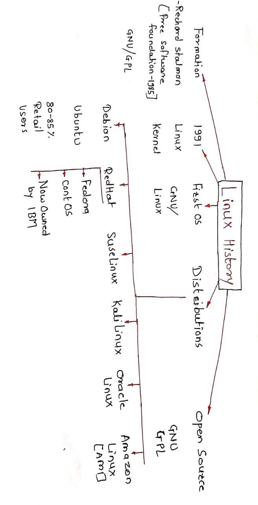

# Linux
### History
- In 1970, Bell lab- unix system. 
- In 1985, rechard stalman- GNU/GPL
- Linux is a kernel Discoverd by linus Torvard in 1991.
- Today 99% softeware works on linux code. 

### Linux Commands
| Commanad | 	          Used For |
| --------- |---------------------  |
| ls	|	 List of files & folder|  
| ls-l	|	 List of files & folder discreptive way|.
| ls -l -h | 	 Human readable form(size and folder)|
| ls -l -h -t |	 Time order (Assending order) |
| ls -l -h -t -r |	 Reverse order (Desending order ) |
|ls -l -h -t -r -F  | Display due to catagries |
| -a	|	 Dispaly hidden file | 
| man |		 Dispaly all flag in details specific command |
| cd |		 Change directory |
| cd-	|	Previous folder where i was |
| cd..	|	Previous folder ( one step back) |
| cd~	|	Users home directory  |
| cp	|	Copy file from one to another location |
| cp-rf	|	Copy folder to another folder |
| mv	|   Move file from one location to another location|
| mv    |   Rename the existing file |
| rm -rf	|	Delete the file Recursive and forcefully |
| pwd	|	Path of present working directory |
| who	|	To Know how many member login to system |
| whoami |	Return value of main user of system |
| history |	How many command have been runnig here |
| exit	  | Exit from cuurent login terminal |
|less	|	Gives more data |
| more	|	Gives less data|
| echo	|	print something on terminal |
| top	|        All system level informstion and current load on system |
| ps-ef |		display all running application |
| touch	|	Create new file |
| ping	| To check conectivity with outside world |
| ifconfig |       configuration of system( IP Address) |
| ssh	   |     Access the remote server (use for log in any other system) |
| which	|	location of command |
| wget	 |       gives the ip of system |
| mkdir	  |      create new directory |
| mkdir	   |     mkdir [FN1/FN2] -p  create folder inside folder |
| rmdir	|	delete directory |
| rm -rf *	delete all folder with files |
| cat |		display content in the file |
| cat>> |		updat existing file |
| cat>	|	Add content |
| tail	|	use for continus reading |
| clear	|	clear all |

### File system:
- **/boot** 
   - system Kernal is stored here. 
- **/home** 
    - users home folders are stored here.
- **/root** 
     - home folders for root users.
- **/sbin** 
    - System binary and system admin.
- **/bin** 
    - binary files stored.
- **/var** 
    -   systems veriable files and like logs and other Non-criitical files.
- **/etc** 
    - System configiration are stored.
- **/opt** 
    - Optional root folders.
- **/usr** 
    - 3rd party application are stored.
- **/proc**
    - In-memories system process details.
- **/temp** 
    - Temporary files and folders.
- **/dev** 
    -  Hardware device interface.
- **/mnt** 
    - mount external hard drive or USB.
- **/media** 
    - Used for monitoring CD-ROM and flopy.
- **/(Root)** 
    - Entry point for linux system.

